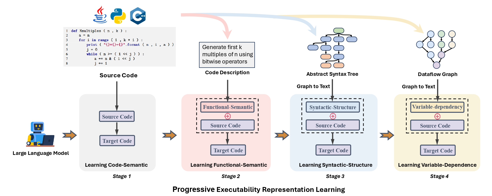

# 🔥ExeCoder: Empowering Large Language Models with Executability Representation for Code Translation 

[[Project page]](https://execoder4trans.github.io/) [[Paper]](https://arxiv.org/abs/2501.18460)

​    Minghua He<sup>1</sup>*, Fangkai Yang<sup>2</sup>, Pu Zhao<sup>2</sup>, Wenjie Yin<sup>3</sup>, Yu Kang<sup>2</sup>, Qingwei Lin<sup>2</sup>, Saravan Rajmohan<sup>2</sup>, Dongmei Zhang<sup>2</sup>, Qi Zhang<sup>2</sup>

<sup>1</sup>Peking University, <sup>2</sup>Microsoft, <sup>3</sup>KTH Royal Institute of Technology

<sup>*</sup>Work is done during an internship at Microsoft.



## 📝 Project Structure

```
├─checkpoint              # Saved models
├─data                    # IFT data
├─evaluation              # Code Translation Evaluation 
├─exe_repr_generation        
|  ├─lang_processors      # Programming Language Processors 
|  ├─parser               # Programming Language Parsers 
|  ├─ast_tools.py         # Processing Syntactic-structure Representation 
|  ├─dataflow_tools.py    # Processing Variable-dependency Representation
|  └─deduplication.py     # Deduplication data
|  └─XLCoST_preprocess.py # Processing XLCoST
├─src                     # Run SFT
└─tools                   # JDK for Evaluation
└─TransCoder-test-X.zip   # Enhanced Benchmark
```


## ⚙️ Environment

**Key Packages:**

datasets==2.18.0

fire==0.6.0

gradio==4.39.0

numpy==1.26.4

openai==0.8.0

pandas==2.2.2

torch==2.2.1

tqdm==4.64.1

transformers==4.42.4

tree_sitter==0.21.0

tree_sitter_go==0.21.0

tree_sitter_c_sharp==0.21.0

tree_sitter_java==0.21.0

tree_sitter_javascript==0.21.0

tree_sitter_php==0.22.4

tree_sitter_python==0.21.0

vllm==0.4.1

openpyxl==3.1.5

deepspeed==0.14.2

accelerate==1.0.1

tensorboardX


## 📜 Preparation

You need to follow these steps to **completely** run `ExeCoder`.
- **Step 1:** Download [XLCoST](https://github.com/reddy-lab-code-research/XLCoST) and put it under `data` folder.
- **Step 2:** Download [deepseek-coder-6.7b-instruct](https://huggingface.co/deepseek-ai/deepseek-coder-6.7b-instruct) and put it under `checkpoint` folder.
- **Step 3:** Download [jdk-10.0.2](#jdk) and put it under `tools` folder.
- **Step 4:** Prepare the dependencies in [Environment](#Environment).


## 🚀 Quick Start
you can run `ExeCoder` with this code:

- Preprocess XLCoST dataset to XLCoST-Instruct.
```
python exe_repr_generation/XLCoST_preprocess.py
```

- Instruction Tuning for Learning Executability Representation.
```
sh train.sh
```

- Inference.
```
sh inference.sh
```

- Evaluation.
```
sh evaluation.sh
```

## 📝 Citation and Reference

If you find this paper useful, please consider staring 🌟 this repo and citing 📑 our paper:

```
@misc{he2025execoderempoweringlargelanguage,
      title={ExeCoder: Empowering Large Language Models with Executability Representation for Code Translation}, 
      author={Minghua He and Fangkai Yang and Pu Zhao and Wenjie Yin and Yu Kang and Qingwei Lin and Saravan Rajmohan and Dongmei Zhang and Qi Zhang},
      year={2025},
      eprint={2501.18460},
      archivePrefix={arXiv},
      primaryClass={cs.SE},
      url={https://arxiv.org/abs/2501.18460}, 
}
```

